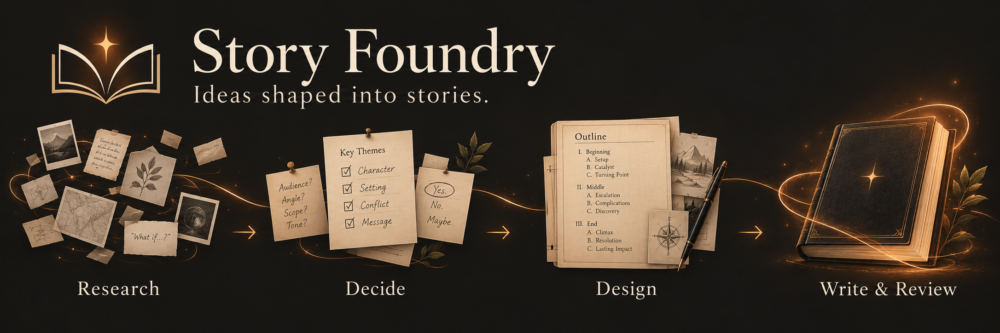

# Story Foundry



Story Foundry is an agent-friendly workshop for building ambitious long-form
fiction with the same care given to a well-designed system: its research,
creative decisions, continuity, chapter plans, revisions, and reading editions
remain visible, connected, and easy to revisit. Rather than asking an agent to
jump straight to pages, it guides human and AI collaborators from evidence and
open questions through deliberate approval gates to a reviewed manuscript and a
validated EPUB—while keeping the editor in charge of every consequential choice.

It supports original fiction, public-domain adaptations, literary criticism, and
properly licensed narrative projects. This clean distribution contains no
case-study research, manuscript, map, or generated edition.

Story Foundry is available under the [MIT License](LICENSE).

## Approach

Story Foundry is an experiment in how coding agents can participate in serious
long-form literature without becoming automatic novelists. It treats a narrative
partly as a complex project: evidence, assumptions, dependencies, interfaces,
state, and revisions live in small, versionable files instead of only in a
conversation or an opaque draft.

The agent is a research partner and drafting collaborator; the editor decides
what the work means. Successive approval gates let the editor reject an
interpretation, choose among alternatives, redirect a theme, preserve a mystery,
or request more evidence before that choice can shape the manuscript.

- **Phases 1–3 — understand:** analyze permitted sources or establish an
  original-work baseline, prepare character dossiers, and catalogue open
  questions.
- **Phase 4 — decide carefully:** turn only necessary speculative bridges into
  explicit assumptions, compare alternatives, and obtain editor approval.
- **Phases 5–7 — design:** establish purpose, themes, ending, chapter
  architecture, character arcs, active cast, world model, and spatial continuity.
- **Phase 8 — write and review:** prepare one chapter brief, draft and revise
  the chapter, then wait for review before moving ahead.

The resulting folders form an inspectable chain from research to prose: readers
can see not only what was written, but which evidence, choices, and constraints
produced it.

## Start a new project

1. Define the project title in `epub/metadata.yaml`.
2. State the permitted source corpus and rights constraints in this README.
3. Read `AGENTS.md`, `status.md`, and `phase_instructions/README.md`.
4. Start Phase 1. Change the phase order only with an explicit documented
   reason.

For an original novel, record `Original work; no external source corpus.` under
the source boundary below. For a source-based project, document the relevant
edition, permission, or public-domain status and use locators rather than
unverified quotations.

## Project definition

- **Working title:** Untitled Novel
- **Source boundary:** To be defined before Phase 1.
- **Rights and publication constraints:** To be defined before drafting.
- **Editor:** To be defined.

Give the coding agent an initial direction that states interests and boundaries
without pretending that the connecting decisions are solved. For example:

```text
Read AGENTS.md and status.md, then review the Phase 1–3 material.

I want to develop an original political-ecological novel about the limits of
historical memory and the cost of decentralizing power. I want the ending to
leave one central cause unresolved. Identify the construction assumptions this
requires. Create one assumption document per decision, present evidence and
alternatives, recommend a preferred option, and stop for my approval. Do not
begin story architecture yet.
```

Once the assumption register is coherent, a useful transition prompt is:

```text
Reconcile the assumptions I approved, identify any remaining decisions that
block Phase 5, and update status.md. If Phase 4 is complete, propose the order
for developing purpose, themes, mystery policy, and ending. Do not draft an
outline until I approve the architectural direction.
```

This template starts empty. Later, when reusing an established project, run
`python3 tool.py reset-project` to inspect the exact removal scope. Its default
reset preserves Phase 1–3 research and removes the authored Phase 4–8 solution;
add `--include-research` for a complete restart. Never confirm a reset without
reviewing its printed targets.

## Method at a glance

1. Analyze the permitted source material or define the original-work baseline.
2. Build character evidence and an open-question register.
3. Record and approve only the assumptions construction requires.
4. Establish purpose, themes, mystery policy, ending, outline, arcs, and world
   material before prose.
5. Prepare one chapter brief, draft one chapter, revise it, and wait for review.
6. Build a reader edition only from the notice, optional map, and numbered
   manuscript chapters.

The aim is original, clear prose with philosophical depth, political realism,
material causation, restraint, and long-term consequence—not imitation of a
source author's expression. Current production progress and the active review
gate are recorded in [`status.md`](status.md). `AGENTS.md` provides the
project-wide rules; each phase has detailed instructions in
`phase_instructions/`.

## Source hierarchy

1. **Permitted source evidence:** facts supported by the documented source
   corpus, or the declared baseline for an original work.
2. **Synthesis:** an interpretation supported by evidence but not stated as a
   source fact.
3. **Editor direction:** a requested premise or boundary.
4. **Construction assumption:** an approved speculative bridge required to turn
   evidence and direction into a coherent story.
5. **Unknown:** a matter deliberately preserved or awaiting a decision.

Use edition-and-location locators for source material. Do not treat remembered
wording as a quotation, and do not add text, images, or other material for which
the project lacks the necessary rights.

## Repository guide

- `analysis/` — source, thematic, style, chronology, and end-state analysis.
- `characters/` — source-grounded character dossiers.
- `questions/` — unresolved questions and preservation decisions.
- `assumptions/` — approved construction assumptions.
- `story/` — vision, themes, ending, outline, and chapter briefs.
- `arcs/` — character transformations across the project.
- `cast/` — stable drafting dossiers for active characters.
- `world/` — required history, institutions, ecology, technology, and maps.
- `manuscript/` — numbered chapters and edition notice.
- `epub/` — EPUB metadata, stylesheet, and optional map front matter.
- `dist/` — generated editions; ignored by Git.

The character resources have distinct roles: `characters/` records evidence and
starting-state analysis, `arcs/` records transformation through the story, and
`cast/` records the approved current drafting state. For any scene, consult the
relevant cast dossier and arc together.

## Reset and EPUB commands

```sh
python3 tool.py reset-project
python3 tool.py reset-project --yes
python3 tool.py reset-project --include-research --yes
python3 tool.py build-epub
python3 tool.py validate-epub
```

The reset command lists its exact targets until `--yes` is supplied. EPUB builds
require Pandoc and fail until at least one `manuscript/chapter_XX.md` exists.

## Generated edition

The default build writes `dist/project.epub`. It contains only the static draft
notice, an optional reader-facing map, and numbered manuscript chapters in
order. The build validates the EPUB archive, reading order, notice placement,
map references, and the reader-neutral stylesheet policy.
